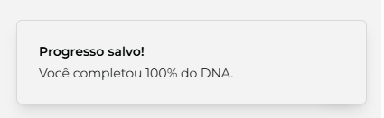
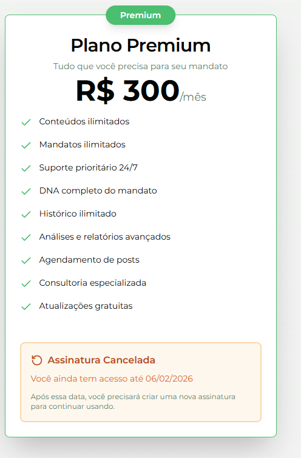
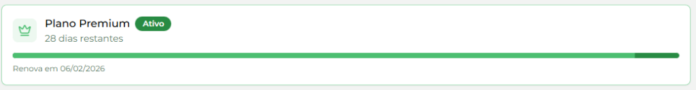
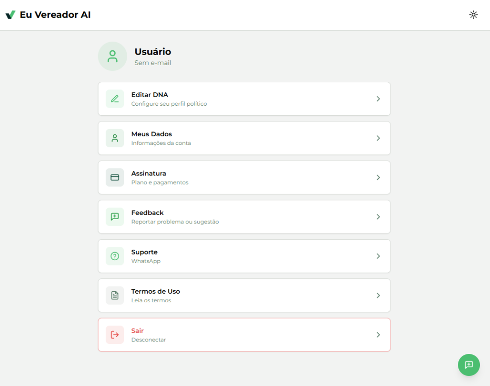
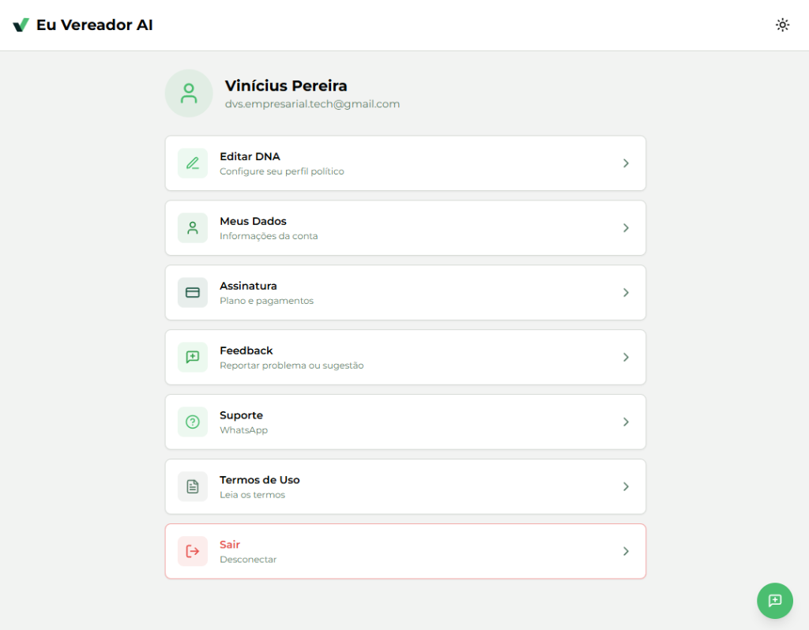
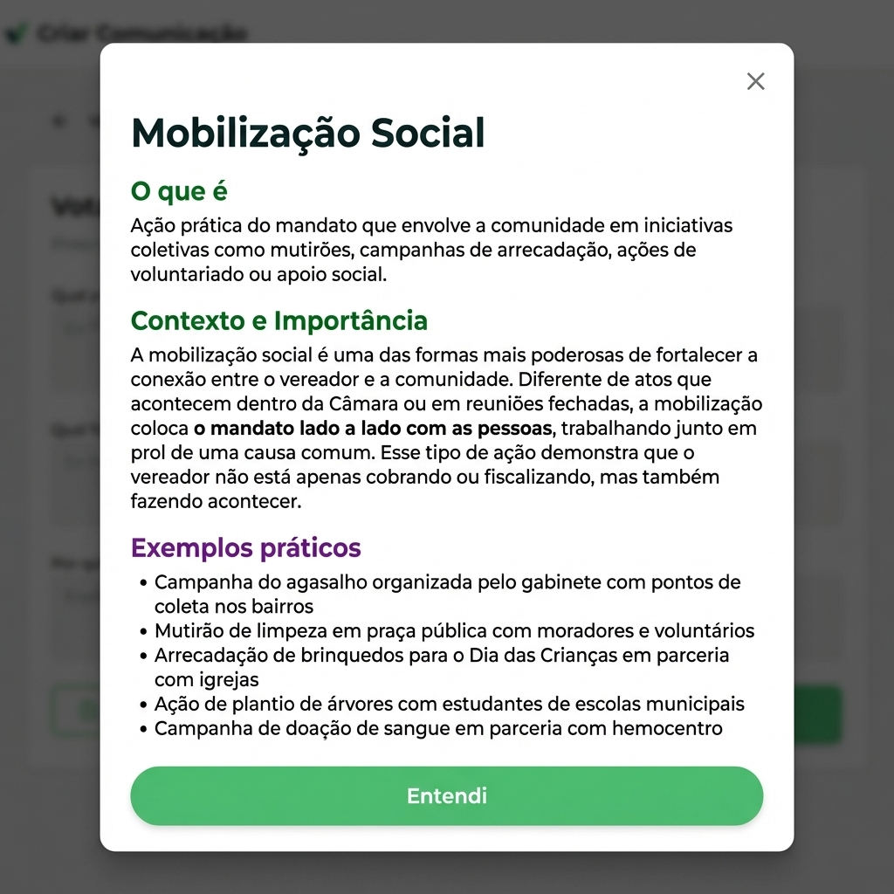

# Requests for Adjustments and Improvements - 09/01/2026

This document organizes the demands into two main sections: feedback on found bugs and requests for new features/adjustments.

---

## Section 1: Bug Feedback (Current Version)

### 1.1. Error in Biography (DNA)
**Problem:** When editing the **Biografia (DNA)**, the completion message appears, but when returning to the dashboard, the status is not shown as complete.

<div style="page-break-inside: avoid;">
<strong>Evidence:</strong>
<p align="center"></p>
<p align="center"></p>
</div>

### 1.2. Automatic Draft Saving
**Problem:** Currently, drafts are only saved when the user clicks the "Salvar Rascunho" button.

**Requested Improvement:** Implement automatic draft saving whenever the user:
- Leaves the input screen.
- Closes the window or browser tab.
- Navigates to another area of the system.

**Objective:** Avoid progress loss if the user exits accidentally or forgets to save manually.

### 1.3. Draft Deletion Confirmation
**Problem:** When deleting a draft on the dashboard, the action is executed immediately without prior confirmation, and only an "Undo" notification appears.

**Requested Improvement:**
1.  **Confirmation Modal/Alert:** Before deleting, display a confirmation request (e.g., "Tem certeza que deseja excluir este rascunho?").
2.  **Undo Notification:** Keep the "Desfazer" (Undo) option after confirmation and deletion as an extra security layer.

**Objective:** Prevent accidental deletion of important content.

### 1.4. Inconsistency in Renewal Status (Cancelled Plan)
**Problem:** Even after the user cancels the subscription (confirmed on the details screen), the main dashboard still displays the message "Renova em 06/02/2026", which confuses the user.

**Evidence:**
<div style="page-break-inside: avoid;">
<strong>Correct State (Subscription Screen):</strong>
<p align="center"></p>
</div>

<div style="page-break-inside: avoid;">
<strong>Incorrect State (Dashboard):</strong>
<p align="center"></p>
</div>

### 1.5. User Data Loading Delay (Profile Screen)
**Problem:** When accessing the Profile screen, the system initially displays a generic state ("Usuário" and "Sem e-mail") and takes a few moments to load the real user data.

**Evidence:**
<div style="page-break-inside: avoid;">
<strong>Initial State (Loading):</strong>
<p align="center"></p>
</div>

<div style="page-break-inside: avoid;">
<strong>Final State (Loaded):</strong>
<p align="center"></p>
</div>

---

## Section 2: Additions and Improvements (New Implementations)

### 2.1. Change in Channel System
**Objective:** Change the representation of channels to align with the agent logic.

<div style="page-break-inside: avoid;">
<strong>Visual Reference (How it should look):</strong>
<p align="center"></p>
<p align="center"></p>
</div>

**Data Structure:**
The structure must strictly follow the `canais.json` file.

Example of expected structure:
```json
"Instagram": {
    "formatos": [
        "Reels",
        "Stories",
        "Card/Foto",
        "Carrossel"
    ]
}
```

### 2.2. Explanation Modal in "Ato de Mandato"
**Objective:** Add an explanatory modal on the **Ato de Mandato** form screen to assist the user. The modal must have an access button and contain the following sections:
- **O que é**
- **Contexto e importância**
- **Exemplos práticos**

<div style="page-break-inside: avoid;">
<strong>Visual Reference (Layout Suggestion):</strong>
<p align="center"></p>
</div>

### 2.3. Update of Mandate Act Forms
**Objective:** Update forms and placeholders for full compliance with the `atos_de_mandato.json` file.

**Implementation Details:**
The JSON file contains the "source of truth" for each type of act (Mobilização, Reunião, etc.):
1.  **Modal Texts:** Use data from the `explicacao` key (`definicao`, `contexto_e_importancia`, `exemplos_praticos`).
2.  **Form Fields:** Use the list in `perguntas` to generate inputs.

**Note:** Ensure all application forms are synchronized with this JSON.
